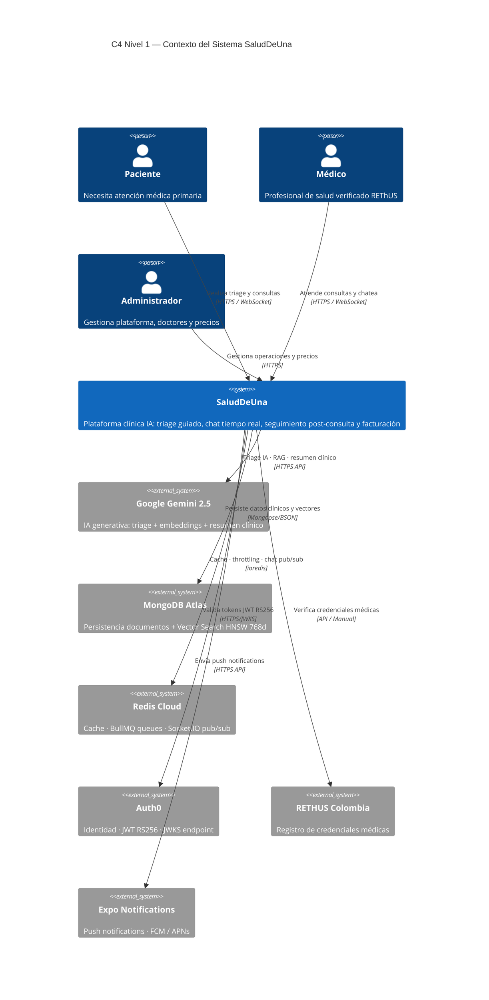
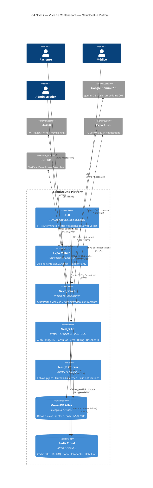
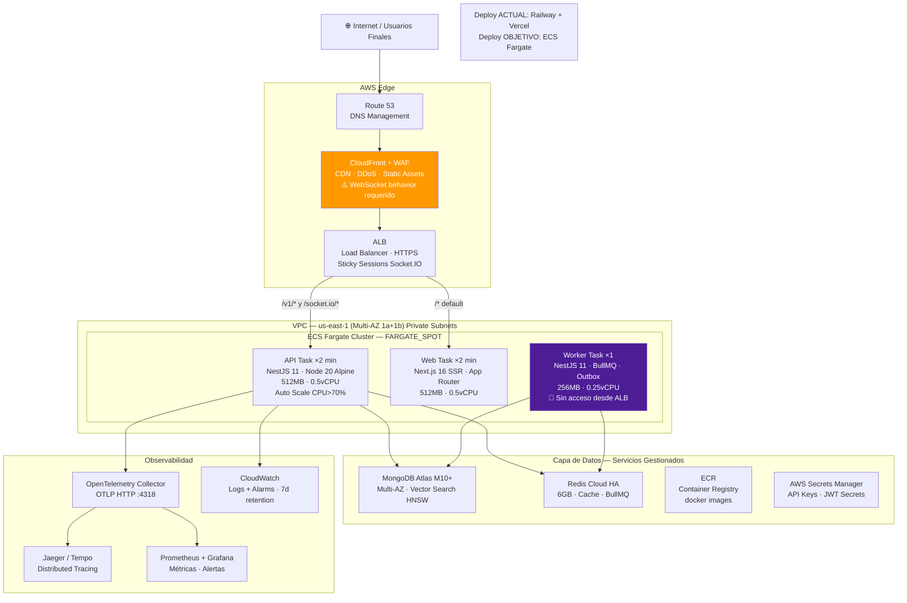
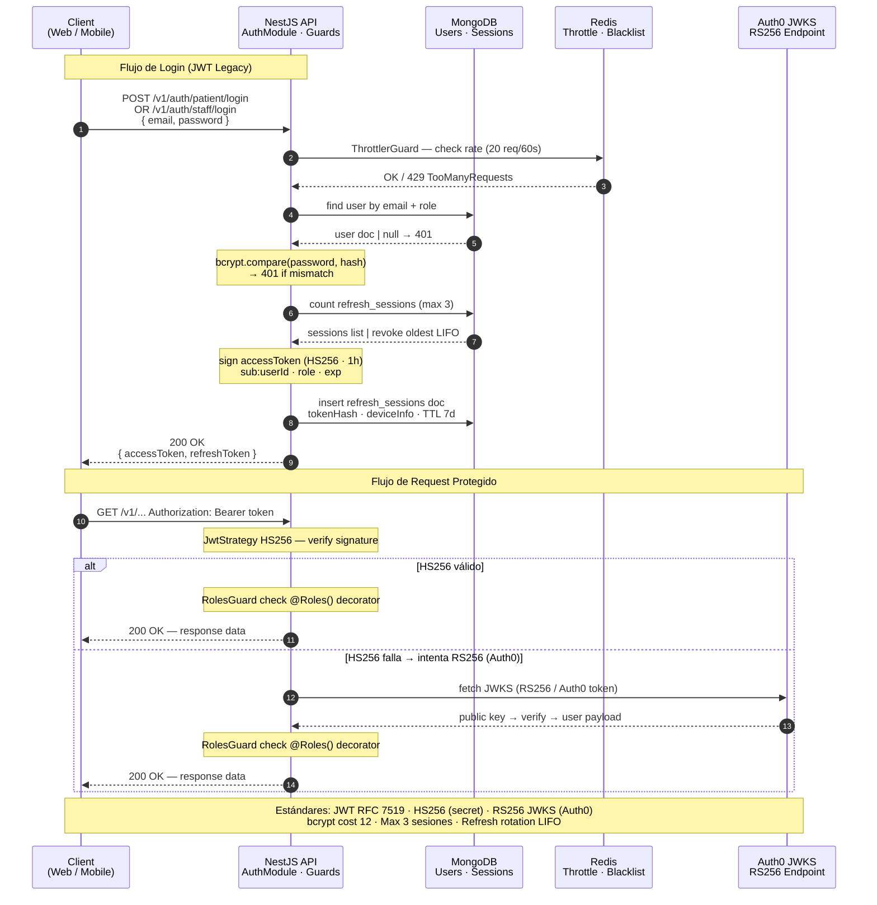
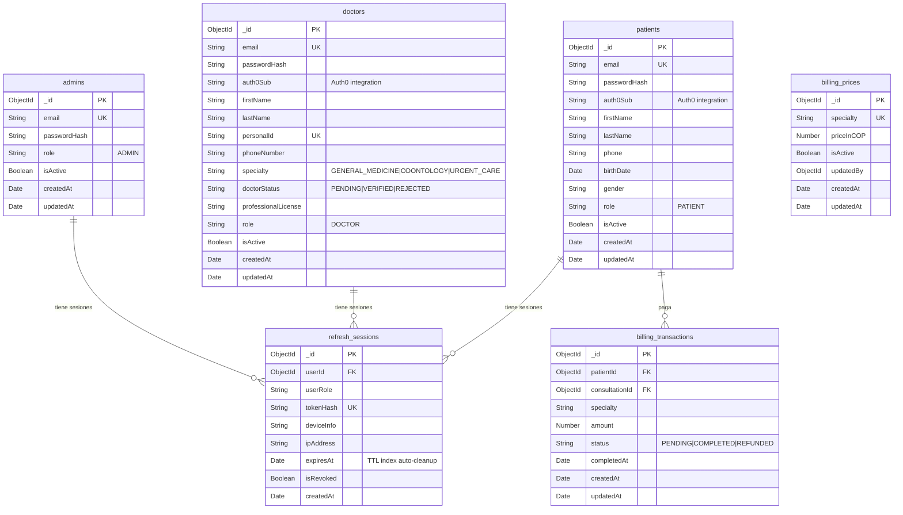
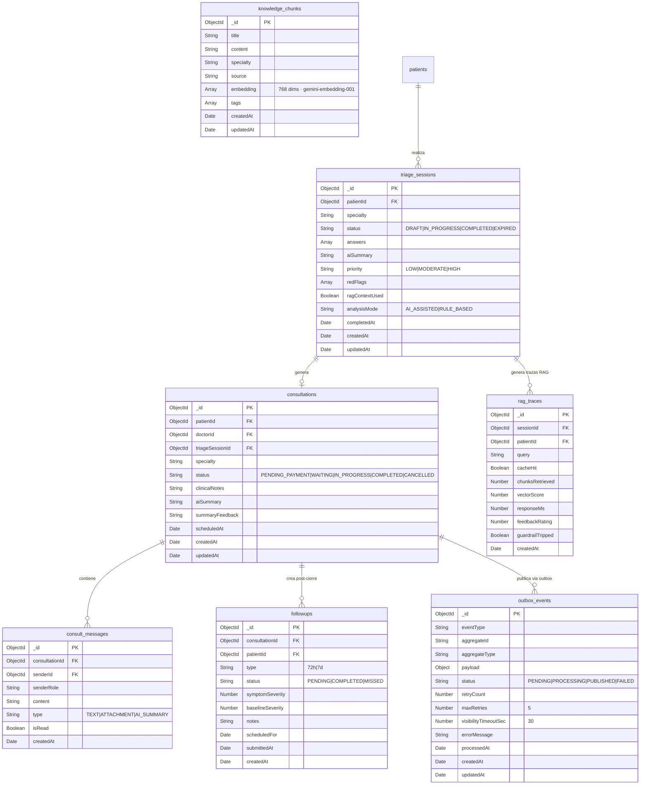
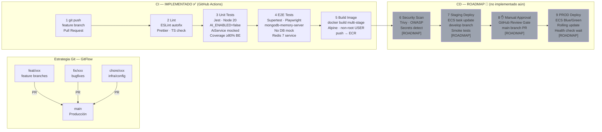
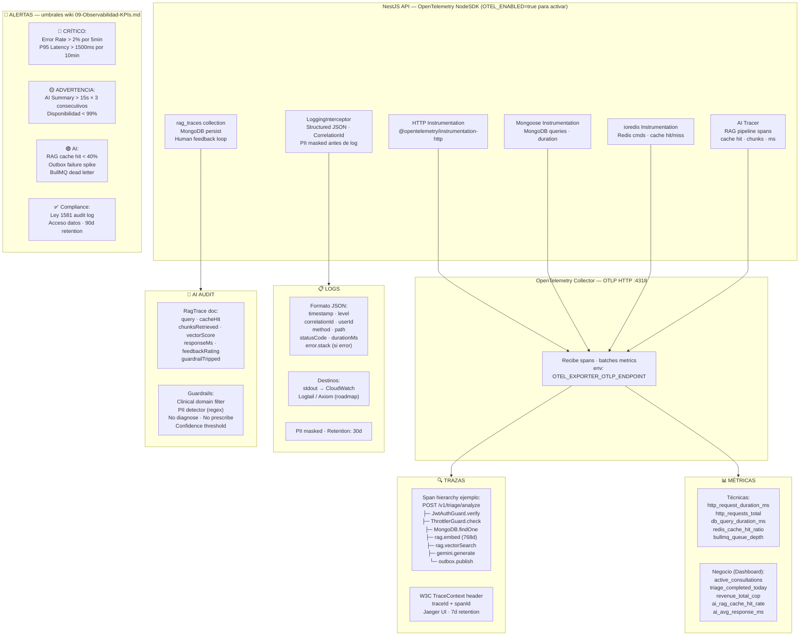

# SaludDeUna — Diagramas Arquitectónicos en Mermaid
> Versión corregida — 19 mayo 2026  
> Para visualizar: VS Code con extensión **Mermaid Preview** o pega en [mermaid.live](https://mermaid.live)

---

## 1. C4 Nivel 1 — Contexto del Sistema



---

## 2. C4 Nivel 2 — Vista de Contenedores



---

## 3. Módulos Backend NestJS

```mermaid
graph TB
    subgraph CORE["🔵 CORE GLOBAL — app.module.ts"]
        AppModule["AppModule\nBootstrap · PORT 3000\nDI Root · Global prefix /v1"]
        ConfigModule["ConfigModule\nJoi Validation · .env global\nFail-fast en startup"]
        CommonModule["Common (Guards/Filters)\nGlobalExceptionFilter\nCorrelationId · Logging"]
        DatabaseModule["DatabaseModule\nMongoose · MongoDB Atlas\nAtlas URI · 15+ schemas"]
        RedisModule["RedisModule\nioredis · BullMQ\nSocket.IO adapter"]
        ThrottlerModule["ThrottlerModule\n20 req / 60s / IP\nRedis Store distribuido"]
    end

    subgraph USUARIOS["🟢 DOMINIO: USUARIOS"]
        AuthModule["AuthModule\nJWT HS256+RS256 · Auth0\nLogin · Register · Refresh\nMax 3 sessions · Provisioning"]
        PatientsModule["PatientsModule\nPerfil paciente\nTimeline clínico"]
        DoctorsModule["DoctorsModule\nEspecialidad · Schedule\nREThUS verify · Availability"]
        AdminsModule["AdminsModule\nAdmin seeder\nPerfil administrador"]
    end

    subgraph CLINICO["🟡 DOMINIO: CLÍNICO"]
        TriageModule["TriageModule\nAI Questionnaire\nRedFlagsEngine\nGuardrailService\nSpecialty questions"]
        ConsultationsModule["ConsultationsModule\nQueue · PENDING→COMPLETED\nAssign · Close · Rate · Feedback"]
        ChatModule["ChatModule\nSocket.IO rooms\nWebSocket msgs\nRedis IO adapter"]
        BillingModule["BillingModule\nTransacciones COP\nRevenue metrics\nBillingPriceSeeder"]
        FollowupsModule["FollowupsModule\nBullMQ jobs\n72h + 7d auto-followup\nEscalación si empeora"]
        NotificationsModule["NotificationsModule\nPush + in-app\nExpo Push tokens\nFCM / APNs"]
    end

    subgraph IARAGROUP["🟣 DOMINIO: IA / RAG"]
        AiModule["AiModule\nGemini 2.5-flash\nGenerate · Summarize\nPrompt versioning · Audit log"]
        KnowledgeModule["KnowledgeModule\nKnowledgeChunks · Chunking\ngemini-embedding-001\nAtlas Vector Search HNSW 768d"]
        RagModule["RagModule\nPipeline 8 pasos\nCache Redis 300s\nRagTrace · Feedback\nbuildTriageEvidence()"]
    end

    subgraph INFRA["🔴 INFRAESTRUCTURA"]
        OutboxModule["OutboxModule\nTransactional Outbox\nRetry · Backoff x5\nExactly-once semantics"]
        DashboardModule["DashboardModule\nKPIs negocio · AI metrics\nRevenue metrics · Alerts"]
        AdminModule["AdminModule\nDoctor verification\nUser management\nCSV export"]
        OtelBootstrap["OTel Bootstrap\nmain.ts init · NO NestJS module\nNodeSDK · OTLP HTTP\nAuto-instrumentación"]
    end

    subgraph CC["⚫ CROSS-CUTTING CONCERNS vía APP_GUARD / APP_INTERCEPTOR"]
        JwtAuthGuard["JwtAuthGuard — Global · @Public() bypass"]
        RolesGuard["RolesGuard — PATIENT / DOCTOR / ADMIN"]
        ThrottlerGuard2["ThrottlerGuard — 20 req / 60s / IP"]
        LoggingInterceptor["LoggingInterceptor — Structured JSON · CorrelationId"]
        GlobalExceptionFilter2["GlobalExceptionFilter — statusCode · message · CID"]
        ValidationPipe2["ValidationPipe — class-validator · whitelist · transform"]
    end

    %% Key dependencies
    TriageModule --> AiModule
    TriageModule --> RagModule
    RagModule --> KnowledgeModule
    RagModule --> AiModule
    ConsultationsModule --> OutboxModule
    FollowupsModule --> OutboxModule
    ChatModule --> RedisModule
```



---

## 4. Arquitectura de Despliegue AWS (Objetivo)



---

## 5. Pipeline RAG Clínico

```mermaid
flowchart LR
    Q["1️⃣ Query\nEntrada\nUsuario"]
    N["2️⃣ Normalize\nLimpieza\nSHA-256 key"]
    C{"3️⃣ Cache?\nRedis TTL\n300s hit?"}
    E["4️⃣ Embed\nGemini\nembedding-001\n768 dims"]
    S["5️⃣ Search\nAtlas\n&#36;vectorSearch\ncosine sim"]
    R["6️⃣ Re-rank\nVector score\nTOP_K=8"]
    G["7️⃣ Generate\nGemini\n2.5-flash"]
    Resp["8️⃣ Response\nCitations\n+ RagTrace"]

    Q --> N --> C
    C -- "MISS" --> E --> S --> R --> G --> Resp
    C -- "HIT ⚡\nSaltar E+S" --> G

    subgraph Guardrails["🛡 Guardrails aplicados en paso 7"]
        GR1["Prompt injection protection"]
        GR2["System instruction framing"]
        GR3["CLINICAL_AI_DISCLAIMER appended"]
        GR4["No diagnostica · No prescribe"]
    end

    subgraph UseCases["Funciones que invocan el pipeline"]
        UC1["buildTriageEvidence()\nEvidencia clínica para triage IA"]
        UC2["buildConsultationSummary()\nResumen clínico post-consulta"]
        UC3["RAG_PATIENT_EVIDENCE\nEvidencia clínica para paciente"]
    end

    S -- "Sin evidencia" --> Fallback["⚠️ Fallback message\nSin evidencia disponible"]

    style C fill:#F59E0B,color:#fff
    style E fill:#1A73E8,color:#fff
    style S fill:#00684A,color:#fff
    style R fill:#7C3AED,color:#fff
    style G fill:#1A73E8,color:#fff
    style Resp fill:#0077B6,color:#fff
```



---

## 6. Flujo de Autenticación — Secuencia UML



---

## 7. Modelo de Datos — Usuarios, Auth y Billing



---

## 8. Modelo de Datos — Dominio Clínico



---

## 9. Pipeline CI/CD — GitHub Actions → AWS ECS



---

## 10. Stack de Observabilidad — OpenTelemetry



---

## Instrucciones para visualización local

### VS Code
1. Instalar extensión **Bierner.markdown-mermaid** (Markdown Preview Mermaid Support)
2. Abrir este archivo → `Ctrl+Shift+V` para preview

### Mermaid Live Editor
- Pegar cualquier bloque en [mermaid.live](https://mermaid.live)

### GitHub
- Los bloques ` ```mermaid ``` ` se renderizan automáticamente en GitHub

### CLI (exportar a PNG/SVG)
```bash
npm install -g @mermaid-js/mermaid-cli
mmdc -i DIAGRAMAS-MERMAID.md -o output/ -f svg
```

---

*Generado: 2026-05-19 | Versión corregida post-auditoría arquitectónica*
