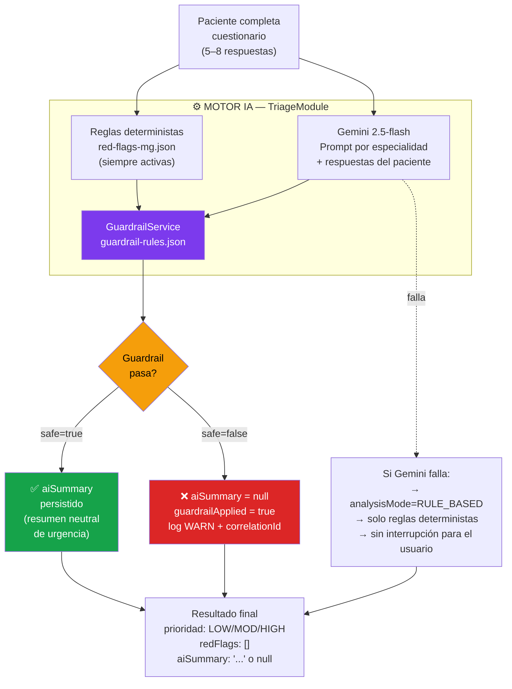
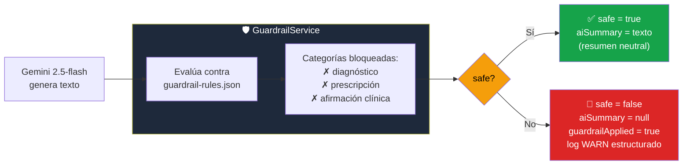
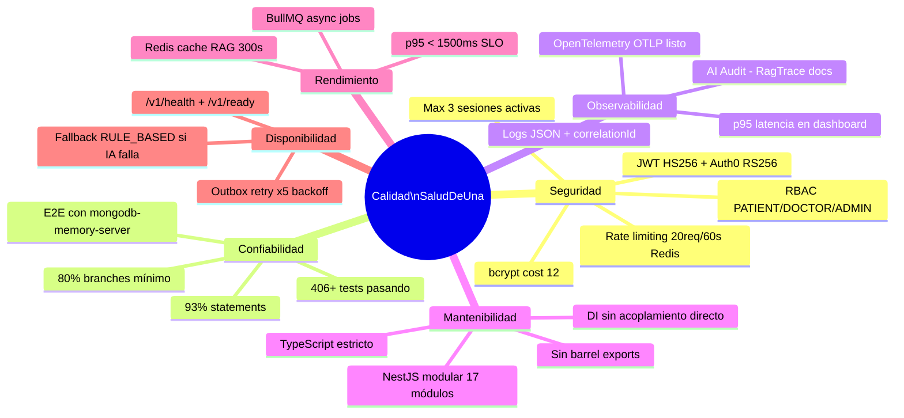
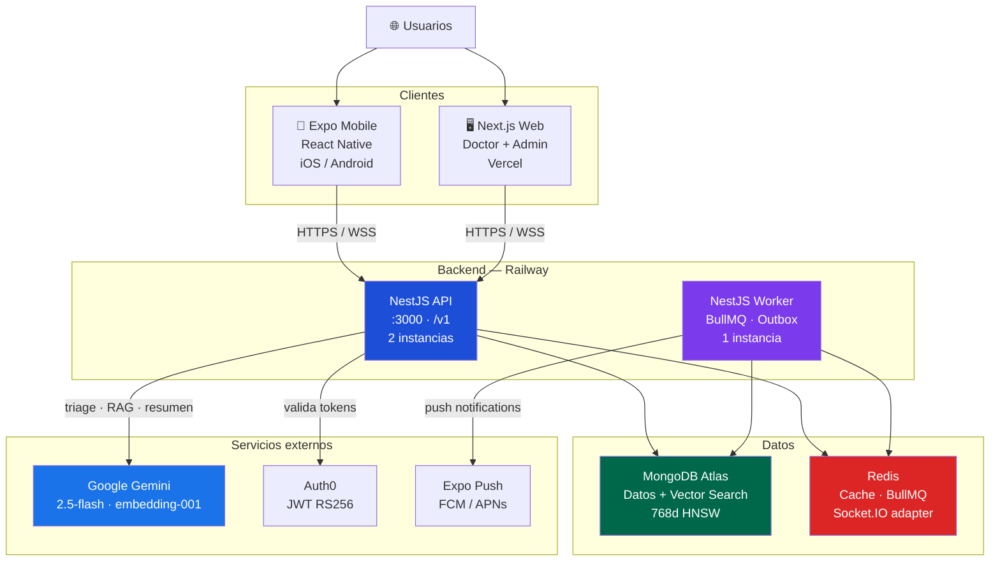
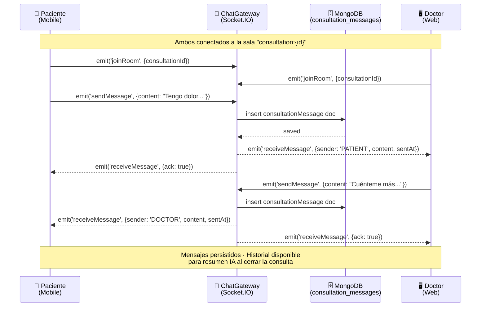

# SaludDeUna — Diagramas para la Presentación

> Todos los diagramas están en Mermaid — renderizables en GitHub, VS Code y mermaid.live.
> Para exportar a SVG/PNG: `mmdc -i DIAGRAMAS-MERMAID.md -o output/ -f svg`
> Los diagramas C4 completos están en: `diagrams/DIAGRAMAS-MERMAID.md`

---

## DÓNDE USAR CADA DIAGRAMA

| Slide | Diagrama | Fuente |
|-------|----------|--------|
| 10 | Flujo E2E del paciente | Este archivo §1 |
| 11 | C4 Nivel 1 — Contexto | DIAGRAMAS-MERMAID.md §1 |
| 12 | C4 Nivel 2 — Contenedores | DIAGRAMAS-MERMAID.md §2 |
| 13 | Módulos backend NestJS | DIAGRAMAS-MERMAID.md §3 |
| 14 | Pipeline de triage IA | Este archivo §2 |
| 16 | Flujo de autenticación | DIAGRAMAS-MERMAID.md §6 |
| 18 | Stack observabilidad | DIAGRAMAS-MERMAID.md §10 |
| 19 | Pipeline RAG | DIAGRAMAS-MERMAID.md §5 |
| 20 | Guardrail clínico | Este archivo §3 |

---

## §1 — Flujo E2E del Paciente (para Slide 10)

```mermaid
flowchart LR
    P(["👤 Paciente\nLogin"])

    subgraph T["📋 TRIAGE IA"]
        T1["Selecciona\nespecialidad"]
        T2["Responde\ncuestionario\n(5–8 preguntas)"]
        T3["Gemini\nanáliza +\nred-flags"]
        T4{"Prioridad"}
    end

    subgraph B["💳 BILLING"]
        B1["Checkout\nsimulado"]
        B2["Consulta\ncreada\nWAITING"]
    end

    subgraph C["🩺 CONSULTA"]
        C1["Cola\nordenada\npor prioridad"]
        C2["Doctor\nasigna"]
        C3["Chat\nSocket.IO\ntiempo real"]
        C4["Resumen IA\nGemini +\nGuardrail"]
        C5["Doctor\ncierra"]
    end

    subgraph F["🔄 FOLLOWUP"]
        F1["72h + 7d\nBullMQ"]
        F2["Push\nnotif."]
        F3["Paciente\nresponde"]
        F4{"¿Empeoró?"}
        F5["✅ Completo"]
        F6["🚨 Nueva\nconsulta\nALTA"]
    end

    P --> T1 --> T2 --> T3 --> T4
    T4 -- "LOW/MOD/HIGH" --> B1 --> B2
    B2 --> C1 --> C2 --> C3 --> C4 --> C5
    C5 --> F1 --> F2 --> F3 --> F4
    F4 -- "No" --> F5
    F4 -- "Sí (+2pts)" --> F6 -.->|"Re-ingresa\na cola"| C1

    style T4 fill:#F59E0B,color:#000
    style F4 fill:#F59E0B,color:#000
    style F6 fill:#DC2626,color:#fff
    style F5 fill:#16A34A,color:#fff
    style C3 fill:#1D4ED8,color:#fff
```



---

## §2 — Pipeline de Triage IA (para Slide 14)



---

## §3 — Guardrail Clínico (para Slide 20)



---

## §4 — Criterios de Calidad (para Slide 15 — alternativa visual)



---

## §5 — Arquitectura de Despliegue Simplificada (para presentación)



---

## §6 — Flujo de Chat en Tiempo Real (para explicar durante el demo)



---

## Instrucciones para exportar a SVG (presentación)

```bash
# Instalar CLI de Mermaid
npm install -g @mermaid-js/mermaid-cli

# Exportar todos los diagramas de DIAGRAMAS-MERMAID.md
mmdc -i salud-de-una-wiki/diagrams/DIAGRAMAS-MERMAID.md \
     -o salud-de-una-wiki/docs/sustentacion/output/ \
     -f svg

# Exportar los diagramas de este archivo
mmdc -i salud-de-una-wiki/docs/sustentacion/presentacion-saluddeuna-diagramas.md \
     -o salud-de-una-wiki/docs/sustentacion/output/ \
     -f svg
```

Los SVGs exportados se pueden insertar directamente en Canva, Google Slides o PowerPoint.

---

## Recomendaciones de uso en la presentación

| Diagrama | Recomendación visual |
|----------|----------------------|
| C4 L1 y L2 | Exportar SVG, insertar en slide con fondo oscuro, leyenda al pie |
| Flujo E2E paciente | Usar versión simplificada (este §1) — no el de 30 nodos |
| Pipeline triage IA | Animación slide-by-slide si la herramienta lo permite |
| Guardrail | Simple y directo — el punto clave es el bloqueo en rojo |
| Módulos backend | Exportar del §3 de DIAGRAMAS-MERMAID.md como SVG |
| Mindmap calidad | Solo si la herramienta renderiza mindmaps — alternativa: tabla de 6 tarjetas |
