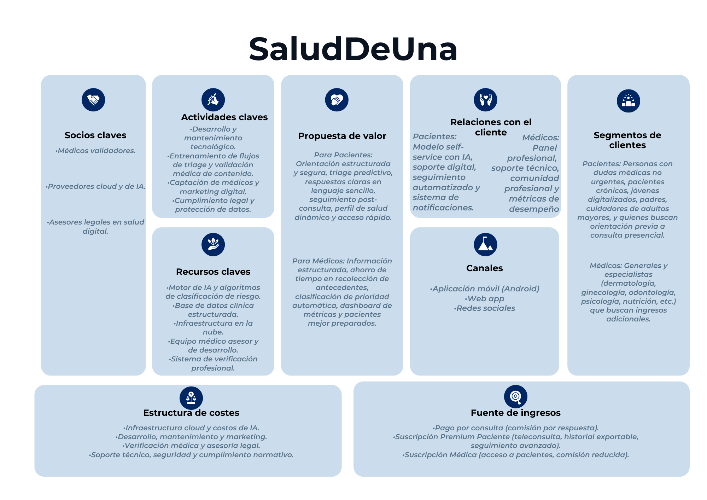

## Objetivo
Documentar la fundamentacion de negocio de `SaludDeUna` usando Business Model Canvas y vincularla con KPIs y decisiones de producto.

## Alcance
Incluye los 9 bloques de Canvas y la relacion con priorizacion del MVP. No incluye estimaciones financieras de largo plazo.

## Business Model Canvas

## Business Case Resumido
- Problema economico: tiempo medico improductivo en recoleccion inicial.
- Hipotesis de valor: mejor informacion inicial reduce tiempo a primera respuesta y mejora continuidad.
- Resultado esperado: aumento de eficiencia clinica y mejor priorizacion de casos de alto riesgo.

## KPIs de Negocio Asociados al Canvas
1. Tiempo a primera respuesta medica.
2. Porcentaje de resumenes marcados como utiles por medicos.
3. Tasa de red flags relevantes confirmadas.
4. Retencion de seguimiento a 7 dias.

## Supuestos de Negocio
- Los pacientes aceptan responder flujos guiados si perciben beneficio de tiempo.
- Los medicos usan mas la plataforma si la calidad del resumen inicial es consistente.
- El modelo hibrido de monetizacion puede validarse inicialmente con simulacion.
