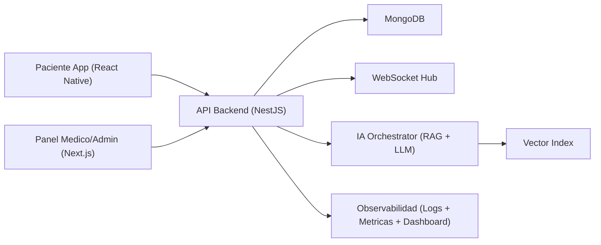
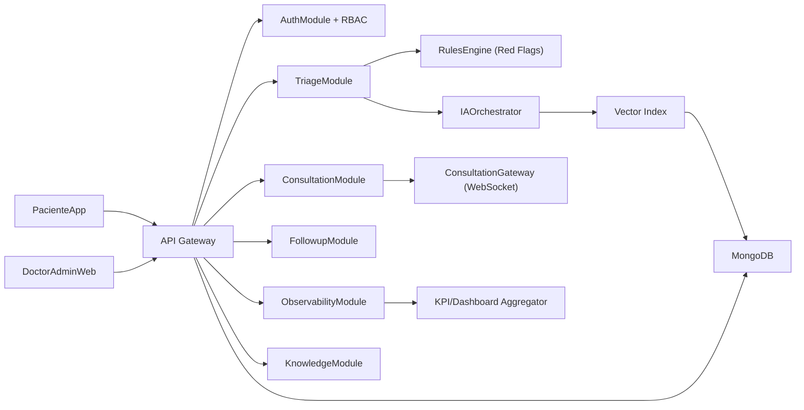
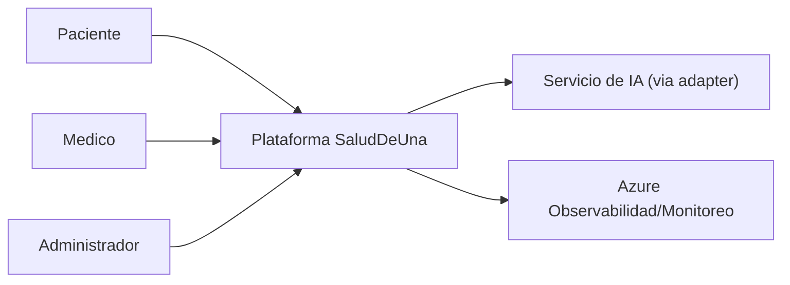
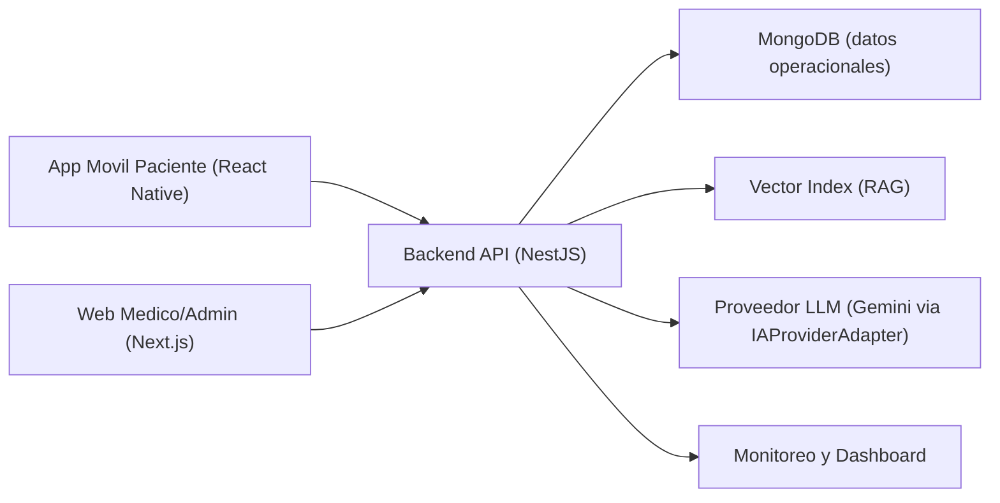
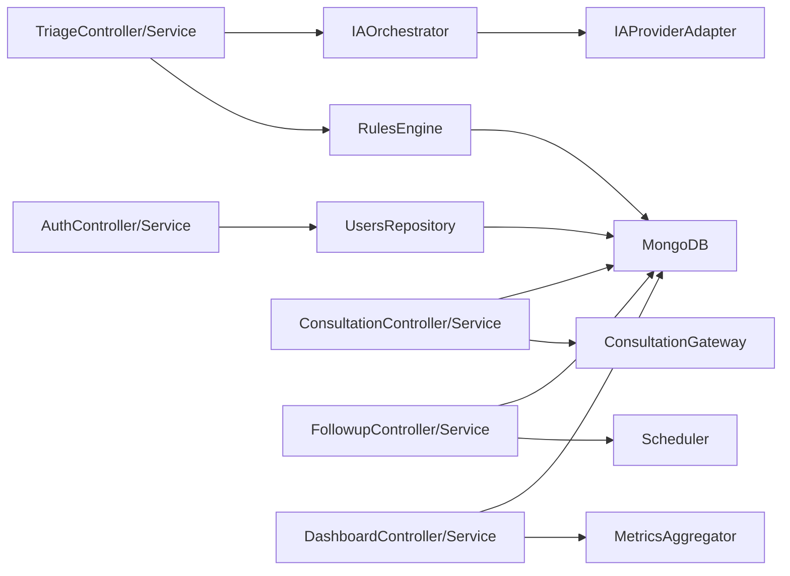

## Objetivo
Definir la arquitectura tecnica base de `SaludDeUna`, sus interfaces publicas, componentes de despliegue y reglas de integracion para el MVP.

## Alcance
Incluye diagrama general, diagrama de componentes, modelo C4 (contexto, contenedores y componentes), APIs `v1`, eventos WebSocket y tipos publicos clave.

## Stack Acordado
- Mobile paciente: React Native (Android objetivo principal del curso).
- Panel medico/admin: React + Next.
- Backend: NestJS.
- Base de datos: MongoDB.
- Tiempo real: WebSocket.
- IA: RAG + Gemini + reglas clinicas.
- Cloud: Azure institucional + adaptador para proveedor IA.

## Diagrama General del Sistema


## Diagrama de Componentes (aplicacion)


## Modelo C4

### C4 - Nivel 1 (Contexto)


### C4 - Nivel 2 (Contenedores)


### C4 - Nivel 3 (Componentes del Backend)


## Vista de Despliegue Base
- Capa cliente:
  - App movil paciente distribuida para Android/iOS (target academico: Android).
  - Web medico/admin desplegada como app web.

- Capa aplicacion:
  - Backend NestJS modular con API REST y WebSocket.
  - Servicio de orquestacion IA con guardrails y adapter de proveedor.

- Capa datos:
  - MongoDB para datos operacionales.
  - Indice vectorial para contexto RAG.

- Capa observabilidad:
  - Logs estructurados.
  - Metricas de latencia, concurrencia y errores.
  - Dashboard tecnico + negocio.

## Interfaces Publicas

### Canales
1. `PacienteApp` (React Native).
2. `DoctorAdminWeb` (React + Next).

### API v1 (REST)
| Metodo | Endpoint | Proposito |
|---|---|---|
| POST | `/v1/auth/patient/register` | Registro de paciente |
| POST | `/v1/auth/doctor/register` | Registro de medico |
| POST | `/v1/auth/login` | Inicio de sesion |
| POST | `/v1/admin/doctors/{doctorId}/rethus-verify` | Validacion REThUS semiautomatica |
| POST | `/v1/triage/sessions` | Crear sesion de triage |
| POST | `/v1/triage/sessions/{sessionId}/answers` | Guardar respuestas de triage |
| POST | `/v1/triage/sessions/{sessionId}/analyze` | Ejecutar analisis IA + reglas |
| POST | `/v1/consultations` | Crear consulta |
| GET | `/v1/consultations/queue` | Ver cola priorizada para medico |
| POST | `/v1/consultations/{id}/messages` | Enviar mensaje en consulta |
| PATCH | `/v1/consultations/{id}/attend` | Cambiar estado OPEN -> IN_PROGRESS |
| PATCH | `/v1/consultations/{id}/close` | Cambiar estado IN_PROGRESS -> CLOSED |
| POST | `/v1/consultations/{id}/summary/generate` | Generar resumen clinico |
| PATCH | `/v1/consultations/{id}/summary/feedback` | Registrar utilidad de resumen clinico |
| POST | `/v1/consultations/{id}/translation` | Traducir clinico <-> paciente |
| POST | `/v1/followups` | Crear/registrar seguimiento post-consulta |
| POST | `/v1/patients/medical-history` | Crear historia clinica |
| GET | `/v1/patients/{id}/timeline` | Obtener evolucion de caso |
| POST | `/v1/patients/dependents` | Crear perfil dependiente (cuidador) |
| GET | `/v1/patients/dependents` | Listar perfiles dependientes |
| GET | `/v1/dashboard/technical` | Dashboard tecnico |
| GET | `/v1/dashboard/business` | Dashboard de KPIs |
| POST | `/v1/billing/simulate-checkout` | Simular compra/plan |
| GET | `/v1/knowledge/articles` | Consultar base de conocimiento |
| POST | `/v1/knowledge/articles/{id}/approve` | Aprobar contenido medico |

### Eventos WebSocket
| Evento | Payload minimo |
|---|---|
| `consultation.message.created` | `consultationId`, `messageId`, `senderRole`, `timestamp` |
| `consultation.status.changed` | `consultationId`, `oldStatus`, `newStatus`, `timestamp` |
| `consultation.priority.updated` | `consultationId`, `oldPriority`, `newPriority`, `reason` |
| `consultation.queue.updated` | `doctorId`, `queueSize`, `topCases` |
| `consultation.followup.reminder.triggered` | `patientId`, `consultationId`, `followupDate` |

### Tipos Publicos (contratos)
```ts
type PriorityLevel = "LOW" | "MODERATE" | "HIGH";
type Specialty = "GENERAL_MEDICINE" | "DENTISTRY";
type TranslationDirection = "TO_PATIENT" | "TO_CLINIC";

interface RedFlag {
  code: string;
  specialty: Specialty;
  severity: "MEDIUM" | "HIGH" | "CRITICAL";
  evidence: string[];
}

interface ClinicalSummary {
  chiefComplaint: string;
  duration: string;
  intensity: string;
  associatedSymptoms: string[];
  currentMedication: string[];
  relevantHistory: string[];
  estimatedPriority: PriorityLevel;
  redFlags: RedFlag[];
}

interface SummaryFeedback {
  useful: boolean;
  comments?: string;
}

interface RethusVerification {
  doctorId: string;
  status: "PENDING" | "VERIFIED" | "REJECTED";
  checkedBy: string;
  checkedAt: string;
  evidenceUrl?: string;
}

interface KpiSnapshot {
  periodStart: string;
  periodEnd: string;
  metricName: string;
  value: number;
  target: number;
  status: "OK" | "WARNING" | "CRITICAL";
}
```

## Seguridad y Cumplimiento Base
- RBAC estricto por rol: paciente, medico, admin.
- Auditoria de acciones sensibles: validacion REThUS, cambios de prioridad, cierre de consulta, feedback de resumen.
- Guardrails de IA: bloquear contenido de diagnostico/prescripcion automatica.
- Datos sensibles minimizados y trazables.
