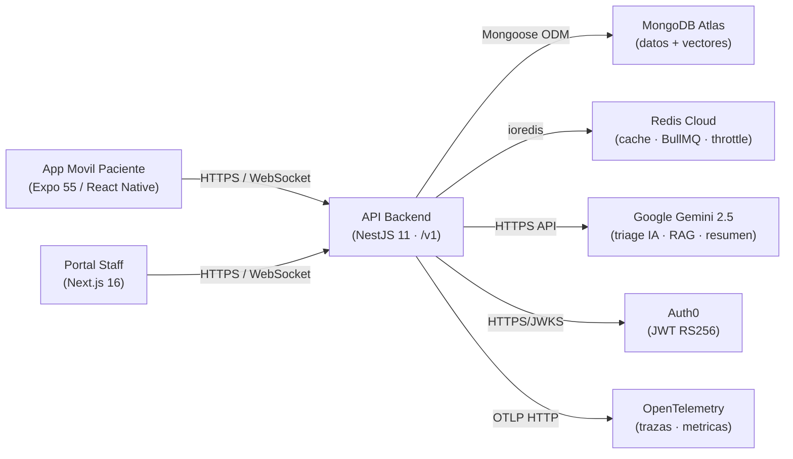
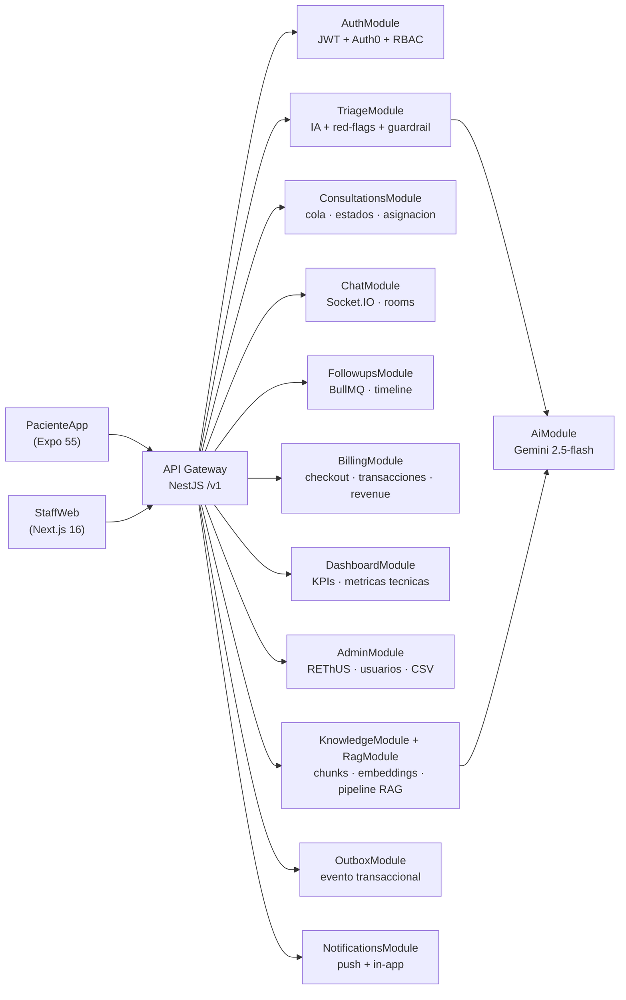

## Objetivo
Definir la arquitectura tecnica base de `SaludDeUna`, sus interfaces publicas, componentes de despliegue y reglas de integracion para el MVP implementado.

## Alcance
Incluye stack tecnico real, diagrama general, modelo C4 (contexto y contenedores), API v1 implementada, eventos WebSocket y tipos publicos clave. Los diagramas detallados y actualizados estan en [DIAGRAMAS-MERMAID.md](../../diagrams/DIAGRAMAS-MERMAID.md).

## Stack Implementado

| Capa | Tecnologia |
|------|------------|
| Mobile paciente | React Native / Expo 55 (Android e iOS, objetivo Android) |
| Panel staff (doctor/admin) | Next.js 16 / App Router / React 19 |
| Backend | NestJS 11 / Node 20+ / TypeScript 5 |
| Base de datos | MongoDB Atlas (Mongoose 9) + Vector Search HNSW 768d |
| Cache y colas | Redis Cloud + BullMQ (ioredis) |
| IA | Google Gemini 2.5-flash (triage, resumen) + gemini-embedding-001 (RAG) |
| Tiempo real | Socket.IO 4 (WebSocket) |
| Auth | JWT HS256 (legacy) + Auth0 RS256 (web) |
| Cloud objetivo | AWS ECS Fargate + ALB (ver diagrama de despliegue) |
| Cloud operativo actual | Railway (backend) + Vercel (web) |
| Observabilidad | OpenTelemetry (OTLP), logs estructurados JSON, dashboard KPIs |

> **Nota:** Las referencias anteriores a "Azure institucional" no corresponden al stack real del proyecto. La infraestructura de despliegue es AWS (objetivo documentado en DIAGRAMAS-MERMAID.md) y Railway/Vercel (despliegue operativo actual).

## Diagrama General del Sistema


```mermaid
flowchart LR
  A["App Movil Paciente\n(Expo 55 / React Native)"] -->|HTTPS / WebSocket| B["API Backend\n(NestJS 11 · /v1)"]
  C["Portal Staff\n(Next.js 16)"] -->|HTTPS / WebSocket| B
  B -->|Mongoose ODM| D["MongoDB Atlas\n(datos + vectores)"]
  B -->|ioredis| E["Redis Cloud\n(cache · BullMQ · throttle)"]
  B -->|HTTPS API| F["Google Gemini 2.5\n(triage IA · RAG · resumen)"]
  B -->|HTTPS/JWKS| G["Auth0\n(JWT RS256)"]
  B -->|OTLP HTTP| H["OpenTelemetry\n(trazas · metricas)"]
```

## Diagrama de Componentes del Backend


```mermaid
flowchart LR
  A["PacienteApp\n(Expo 55)"] --> G["API Gateway\nNestJS /v1"]
  B["StaffWeb\n(Next.js 16)"] --> G
  G --> C["AuthModule\nJWT + Auth0 + RBAC"]
  G --> D["TriageModule\nIA + red-flags + guardrail"]
  G --> E["ConsultationsModule\ncola · estados · asignacion"]
  G --> F["ChatModule\nSocket.IO · rooms"]
  G --> H["FollowupsModule\nBullMQ · timeline"]
  G --> I["BillingModule\ncheckout · transacciones · revenue"]
  G --> J["DashboardModule\nKPIs · metricas tecnicas"]
  G --> K["AdminModule\nREThUS · usuarios · CSV"]
  G --> L["KnowledgeModule + RagModule\nchunks · embeddings · pipeline RAG"]
  D --> M["AiModule\nGemini 2.5-flash"]
  L --> M
  G --> N["OutboxModule\nevento transaccional"]
  G --> O["NotificationsModule\npush + in-app"]
```

## Modelo C4

Los diagramas C4 completos en formato correcto estan en **[DIAGRAMAS-MERMAID.md](../../diagrams/DIAGRAMAS-MERMAID.md)**:
- **Seccion 1:** C4 Nivel 1 — Contexto del sistema
- **Seccion 2:** C4 Nivel 2 — Vista de contenedores

### C4 — Nivel 1 (Contexto — resumen textual)

| Actor / Sistema | Rol |
|-----------------|-----|
| Paciente | Realiza triage, inicia consultas, chatea con el doctor, recibe followups |
| Medico | Atiende la cola de consultas, chatea, genera resumen IA, verifica historial |
| Administrador | Gestiona usuarios, verifica doctores (REThUS), administra precios y revenue |
| Google Gemini 2.5 | Motor IA para triage, embeddings RAG y resumen clinico |
| MongoDB Atlas | Persistencia de datos clinicos y vectores (HNSW 768d) |
| Redis Cloud | Cache, BullMQ, throttling distribuido, Socket.IO pub/sub |
| Auth0 | Proveedor de identidad JWT RS256 con provisioning automatico |
| RETHUS Colombia | Verificacion de credenciales medicas (consulta manual/API) |
| Expo Notifications | Push notifications via FCM/APNs |

### C4 — Nivel 2 (Contenedores — resumen textual)

| Contenedor | Tecnologia | Responsabilidad |
|------------|-----------|-----------------|
| Expo Mobile | React Native / Expo 55 | Experiencia de paciente: triage, consultas, chat, followups |
| Next.js Web | Next.js 16 / App Router | Portal staff: doctor y administrador |
| NestJS API | NestJS 11 / Node 20 | API REST + WebSocket; toda la logica de negocio |
| NestJS Worker | NestJS 11 / BullMQ | Jobs asincronos: followup reminders, outbox dispatcher, push |
| MongoDB Atlas | MongoDB 7 | Datos clinicos, vectores, sesiones, billing |
| Redis Cloud | Redis 7 | Cache, queues, rate limiting, Socket.IO adapter |
| ALB (AWS) | Application Load Balancer | HTTPS termination, sticky sessions para WebSocket |

## Vista de Despliegue — Arquitectura Objetivo

El diagrama completo de despliegue en AWS ECS Fargate esta en la **Seccion 4 de DIAGRAMAS-MERMAID.md**.

Resumen:

- **Capa cliente:** App movil (Android/iOS) + portal web staff.
- **Capa aplicacion:** API NestJS en ECS Fargate (min 2 tareas) + Worker NestJS (1 tarea) detras de ALB.
- **Capa datos:** MongoDB Atlas M10+ (multi-AZ) + Redis Cloud HA.
- **Capa observabilidad:** OpenTelemetry Collector → Jaeger/Tempo + Prometheus/Grafana + CloudWatch.

**Despliegue operativo actual (Sprint 1):** Railway (backend) + Vercel (web).

## API v1 — Endpoints Implementados

Base URL local: `http://localhost:3000/v1`

### Autenticacion

| Metodo | Endpoint | Rol | Descripcion |
|--------|----------|-----|-------------|
| POST | `/v1/auth/patient/register` | Publico | Registro de paciente |
| POST | `/v1/auth/doctor/register` | Publico | Registro de medico |
| POST | `/v1/auth/patient/login` | Publico | Login de paciente (JWT) |
| POST | `/v1/auth/staff/login` | Publico | Login de doctor/admin (JWT) |
| POST | `/v1/auth/refresh` | Publico | Renovar access token |
| POST | `/v1/auth/logout` | Publico | Revocar refresh token |
| GET | `/v1/auth/me` | PATIENT/DOCTOR/ADMIN | Perfil del usuario autenticado |

### Triage asistido por IA

| Metodo | Endpoint | Rol | Descripcion |
|--------|----------|-----|-------------|
| POST | `/v1/triage/sessions` | PATIENT | Crear sesion de triage por especialidad |
| POST | `/v1/triage/sessions/:sessionId/answers` | PATIENT | Registrar respuestas del cuestionario |
| POST | `/v1/triage/sessions/:sessionId/analyze` | PATIENT | Ejecutar analisis IA + reglas (Gemini + red-flags) |

### Consultas medicas

| Metodo | Endpoint | Rol | Descripcion |
|--------|----------|-----|-------------|
| GET | `/v1/consultations/queue` | DOCTOR (verificado) | Cola priorizada de consultas |

### Perfiles de usuario

| Metodo | Endpoint | Rol | Descripcion |
|--------|----------|-----|-------------|
| GET | `/v1/patients/me` | PATIENT | Perfil del paciente |
| PUT | `/v1/patients/me` | PATIENT | Actualizar perfil del paciente |
| GET | `/v1/doctors/me` | DOCTOR | Perfil del medico |
| POST | `/v1/doctors/me/rethus-resubmit` | DOCTOR | Reenviar solicitud de verificacion REThUS |

### Administracion

| Metodo | Endpoint | Rol | Descripcion |
|--------|----------|-----|-------------|
| GET | `/v1/admin/doctors` | ADMIN | Bandeja de doctores con filtros |
| GET | `/v1/admin/doctors/review` | ADMIN | Doctores pendientes de revision |
| POST | `/v1/admin/doctors/:id/doctor-verify` | ADMIN | Verificar doctor (ruta canonical) |
| POST | `/v1/admin/doctors/:id/rethus-verify` | ADMIN | Verificar doctor (alias de compatibilidad) |
| GET | `/v1/admin/users` | ADMIN | Listar todos los usuarios |
| GET | `/v1/admin/users/:role` | ADMIN | Listar usuarios por rol |
| GET | `/v1/admin/users/:role/:userId` | ADMIN | Obtener usuario por ID |
| PATCH | `/v1/admin/users/:role/:userId/active` | ADMIN | Activar/desactivar usuario |
| POST | `/v1/admin/ai/health-check` | ADMIN | Verificar conectividad Gemini |

### Notificaciones

| Metodo | Endpoint | Rol | Descripcion |
|--------|----------|-----|-------------|
| GET | `/v1/notifications/me` | PATIENT/DOCTOR/ADMIN | Notificaciones del usuario |
| PATCH | `/v1/notifications/:id/read` | PATIENT/DOCTOR/ADMIN | Marcar notificacion como leida |
| PATCH | `/v1/notifications/me/read-all` | PATIENT/DOCTOR/ADMIN | Marcar todas como leidas |

### Dashboard y KPIs

| Metodo | Endpoint | Rol | Descripcion |
|--------|----------|-----|-------------|
| GET | `/v1/dashboard/business` | ADMIN | KPIs de negocio (pacientes, doctores, revenue) |
| GET | `/v1/dashboard/technical` | ADMIN | Metricas tecnicas (p95 latencia, error rate) |

### Billing simulado

| Metodo | Endpoint | Rol | Descripcion |
|--------|----------|-----|-------------|
| GET | `/v1/billing/prices` | PATIENT | Precios por especialidad |
| POST | `/v1/billing/checkout` | PATIENT | Iniciar checkout simulado |
| POST | `/v1/billing/checkout/:id/confirm` | PATIENT | Confirmar pago |
| GET | `/v1/billing/transactions/me` | PATIENT | Historial de transacciones del paciente |
| GET | `/v1/billing/transactions/me/:id` | PATIENT | Detalle de una transaccion |
| GET | `/v1/billing/admin/transactions` | ADMIN | Todas las transacciones |
| GET | `/v1/billing/admin/revenue` | ADMIN | Metricas de revenue |
| GET | `/v1/billing/admin/prices` | ADMIN | Ver precios actuales |
| PATCH | `/v1/billing/admin/prices/:specialty` | ADMIN | Actualizar precio de especialidad |

### Salud del sistema

| Metodo | Endpoint | Rol | Descripcion |
|--------|----------|-----|-------------|
| GET | `/v1/health` | Publico | Estado del servicio |
| GET | `/v1/ready` | Publico | Readiness check (MongoDB + Redis) |

> **Documentacion completa:** Swagger/OpenAPI disponible en `http://localhost:3000/v1/docs` en entorno de desarrollo.

## Eventos WebSocket (Socket.IO)

El chat clinico usa salas por consulta (`consultation:{id}`). El gateway esta en `src/chat/chat.gateway.ts`.

| Evento (cliente → servidor) | Descripcion |
|-----------------------------|-------------|
| `joinRoom` | Unirse a la sala de una consulta |
| `sendMessage` | Enviar mensaje clinico en la sala |
| `leaveRoom` | Salir de la sala |

| Evento (servidor → cliente) | Descripcion |
|-----------------------------|-------------|
| `receiveMessage` | Nuevo mensaje en la sala |
| `userJoined` | Participante se unio a la sala |
| `userLeft` | Participante salio de la sala |

## Tipos Publicos Clave

```ts
// Especialidades implementadas en el MVP
type Specialty = "GENERAL_MEDICINE" | "ODONTOLOGY" | "URGENT_CARE";

// Roles de usuario
type UserRole = "PATIENT" | "DOCTOR" | "ADMIN";

// Nivel de prioridad asignado por el triage IA
type PriorityLevel = "LOW" | "MODERATE" | "HIGH";

// Estado de verificacion de medico
type DoctorStatus = "PENDING" | "VERIFIED" | "REJECTED";

// Estado de una consulta medica
type ConsultationStatus =
  | "PENDING_PAYMENT"
  | "WAITING"
  | "IN_PROGRESS"
  | "COMPLETED"
  | "CANCELLED";

// Estado de un registro de seguimiento post-consulta
type FollowupStatus = "PENDING" | "COMPLETED" | "MISSED";

// Estado de una transaccion de billing
type TransactionStatus = "PENDING" | "COMPLETED" | "REFUNDED";

// Red flag detectada durante el triage
interface RedFlag {
  code: string;               // ej. RF-MG-001
  specialty: Specialty;
  severity: "CRITICAL" | "WARNING" | "INFO";
  evidence: string;           // descripcion textual de la evidencia
}

// Respuesta de error estandarizada del backend
interface ApiError {
  statusCode: number;
  message: string;
  correlationId: string;      // UUID v4 para trazabilidad
}
```

## Enums del Backend (valores reales)

### Specialty

- `GENERAL_MEDICINE`
- `ODONTOLOGY`
- `URGENT_CARE`

> **Nota:** El valor `DENTISTRY` que aparecia en documentacion anterior era incorrecto. El valor real y persistido es `ODONTOLOGY`.

### DoctorStatus

- `PENDING` — en espera de verificacion
- `VERIFIED` — credenciales validadas por admin
- `REJECTED` — credenciales rechazadas o vencidas

### RethusState

- `VALID` → establece `DoctorStatus = VERIFIED`
- `EXPIRED` → establece `DoctorStatus = REJECTED`
- `PENDING` → mantiene `DoctorStatus = PENDING`

## Seguridad y Comportamiento Transversal

- **Autenticacion:** JWT obligatorio por defecto. Endpoints publicos via `@Public()`.
- **Autorizacion RBAC:** `@Roles(PATIENT | DOCTOR | ADMIN)` + `RolesGuard` global.
- **Doctor verificado:** `DoctorVerifiedGuard` en rutas de cola de consultas.
- **Rate limiting:** 20 req/60s por cliente IP (throttling distribuido en Redis cuando disponible).
- **Correlation ID:** Header `x-correlation-id` generado/propagado en todas las respuestas.
- **Errores normalizados:** `HttpExceptionFilter` global con formato `{statusCode, message, correlationId}`.
- **CORS:** Origenes configurados por frontend via env: `CORS_ORIGINS_PATIENT` y `CORS_ORIGINS_STAFF`.
- **Guardrail IA:** El motor de triage y RAG filtra contenido de diagnostico, prescripcion y afirmacion clinica. La IA no diagnostica, no prescribe y no reemplaza al medico.

## Referencias a Diagramas Completos

Todos los diagramas arquitectonicos actualizados estan en un unico archivo Mermaid renderizable:

**[DIAGRAMAS-MERMAID.md](../../diagrams/DIAGRAMAS-MERMAID.md)**

| Seccion | Diagrama |
|---------|----------|
| 1 | C4 Nivel 1 — Contexto del sistema |
| 2 | C4 Nivel 2 — Vista de contenedores |
| 3 | Modulos Backend NestJS |
| 4 | Arquitectura de despliegue AWS |
| 5 | Pipeline RAG clinico |
| 6 | Flujo de autenticacion — Secuencia UML |
| 7 | Modelo de datos — Usuarios, Auth y Billing |
| 8 | Modelo de datos — Dominio clinico |
| 9 | Pipeline CI/CD — GitHub Actions |
| 10 | Stack de observabilidad — OpenTelemetry |
