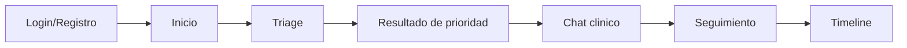

## Objetivo
Documentar los mockups funcionales minimos del MVP movil para cumplir el entregable academico de Inception.

## Alcance
Incluye los cuatro flujos obligatorios: login, triage, chat y seguimiento. Esta version usa mockups de baja fidelidad en texto para alinear alcance funcional, navegacion e interacciones clave.

## Convenciones de mockup
- Plataforma objetivo: Android (React Native).
- Modo: retrato.
- Nivel: low-fi (estructura y flujo, no estilo visual final).
- Maximo de interacciones para tarea principal: `<= 3` cuando aplique.

## Mockup 1: Login y Registro
```text
+---------------------------------------+
| SaludDeUna                            |
| Ingreso seguro                        |
|                                       |
| [ Correo electronico             ]    |
| [ Contrasena                    ]     |
|                                       |
| [ Iniciar sesion ]                    |
|                                       |
| No tienes cuenta? [ Registrarme ]     |
+---------------------------------------+
```

Interacciones:
1. Completar credenciales.
2. Tap en `Iniciar sesion`.
3. Navegacion a `Inicio/Triage`.

## Mockup 2: Triage guiado
```text
+---------------------------------------+
| Triage - Medicina General             |
| Paso 2 de 4                           |
|                                       |
| Sintoma principal                     |
| [ Dolor de cabeza               ]     |
|                                       |
| Intensidad (1-10)                     |
| [-----|----*-----] 7                  |
|                                       |
| [ Atras ]                 [ Siguiente ]|
+---------------------------------------+
```

Interacciones:
1. Responder campos requeridos.
2. Tap en `Siguiente` hasta finalizar.
3. Tap en `Analizar` para prioridad IA.

## Mockup 3: Chat clinico
```text
+---------------------------------------+
| Consulta #C-1024     Estado: ACTIVA   |
|---------------------------------------|
| Medico: Cuentame desde cuando inicio  |
| Paciente: Desde ayer en la tarde      |
| Medico: Tienes fiebre?                |
| Paciente: Si, 38.4                    |
|---------------------------------------|
| [ Escribe tu mensaje...         ] [>] |
+---------------------------------------+
```

Interacciones:
1. Recibir mensajes en tiempo real.
2. Enviar mensaje.
3. Ver cambio de estado de la consulta.

## Mockup 4: Seguimiento post-consulta
```text
+---------------------------------------+
| Seguimiento (72h)                     |
| Como te sientes hoy?                  |
|                                       |
| Intensidad actual (1-10): [ 6 ]       |
| Hay nuevos sintomas? [ Si/No ]        |
| Tomaste medicacion? [ Si/No ]         |
| Comentarios [                      ]  |
|                                       |
| [ Enviar seguimiento ]                |
+---------------------------------------+
```

Interacciones:
1. Completar formulario.
2. Tap en `Enviar seguimiento`.
3. Confirmacion y actualizacion de timeline.

## Mapa de navegacion movil


## Criterios de aceptacion de mockups
- Los 4 flujos obligatorios estan documentados.
- Cada flujo especifica pantalla objetivo e interacciones minimas.
- La navegacion entre pantallas mantiene coherencia con backlog HU-001, HU-003, HU-006 y HU-007.
